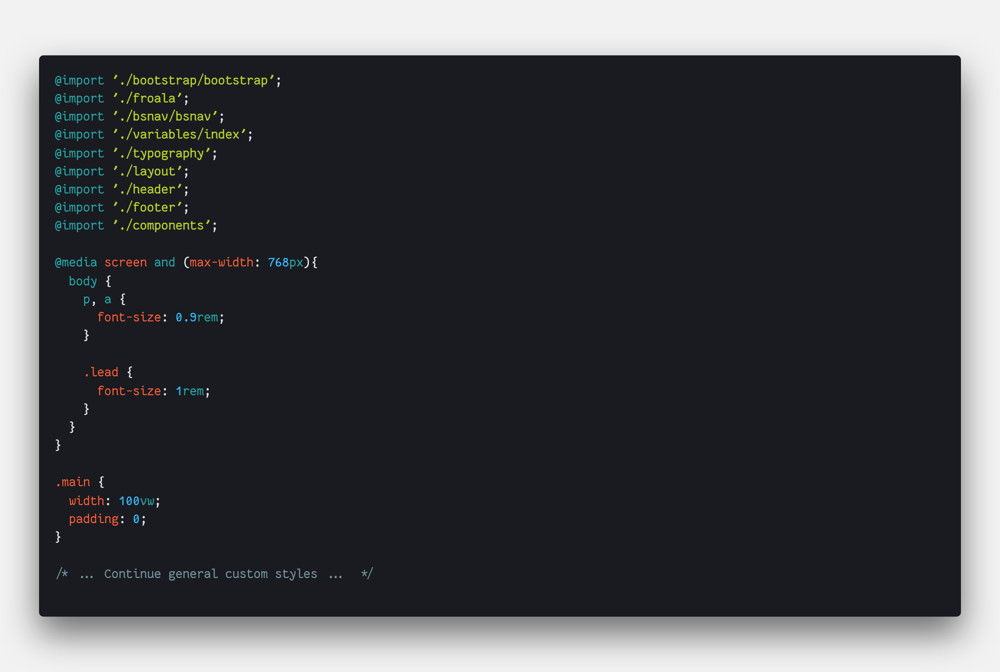
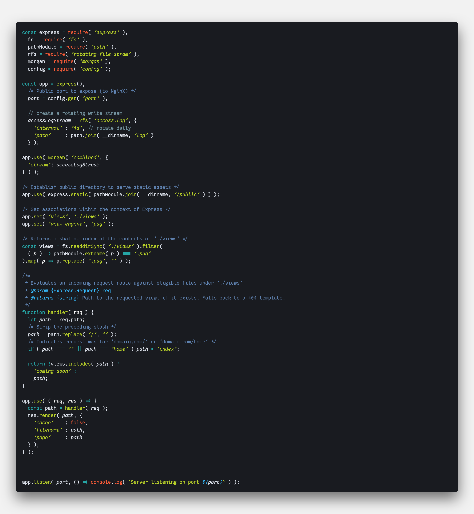

# Project Report

## Site
1.  **Create a new site**
       - A fresh virtual server was created to host the site, using Ubuntu 18.04LTS for the OS, NodeJs to handle the server and website logic/compilation, and NginX to manage the network interfaces.
2. **Length**
      - The site meets requirement
3. **Responsive layout,  custom theme**
      - For the styling and layout, I leveraged a somewhat personally-configured Bootstrap v4, utilizing their development package which containes uncompiled SASS rather than CSS, and incorporating it within my custom styles. An example is shown below:
      
4. **Create an image slider**
      - The home page features an image slider
5. **Images use**
      - Images were used, and alt attributes were included.
6. **Site Navigation**
      - Navigation is customized header menu, with a slide-out side navigation list and nested menus for mobile.
7. **Minimum 5 External Links**
      - Site features an external resources page that serves as a directory of external links.
       http://linksduluth.com/resources
8. **Title, keywords, other meta tags**
      - Pages are labeled appropriately as a by-product of server-side rendering.
9. **Landing Page**
      - http://linksduluth.com/contact
10. **Social Media**
      - Towards the bottom of http://linksduluth.com/

## Security

 A benefit of writing javascript files that control how your server receives, handles and replies to HTTP requests is the enhanced control and ability to fine-tune responses. Reading through the `app.js` file (the main entry point and route handler) provides some examples:

 Here, detailed logging has been set up, as well as some path sanitization and verification. There's certianly much more that can be done in the future.

## SEO

  In order to make this site as Search-Engine-Friendly as I could while still keeping maintenance and time invested at a reasonable level, I followed basic industry-standard best practices in regards to page `<head>` and `<meta>` elements.
  Additionally, page structures are similarly aligned to best-practice and semantic HTML standards.
  This domain is also registered with Google Search Console, and supplies a robots.txt and sitemap.xml file to crawlers.

## Analytics

  Google Analytics scripts are set up on all pages (even this one, hi!) and the GoogleUA key is properly registered.

## Ecommerce

  My e-commerce site was set up under https://links-duluth.myshopify.com - though this was before I realized that the site inventory would have no relation to the name. Regardless, it can be reached by following the above link and supplying the password:

  > ***brunew***

  The site sells artisan soaps and candles from different geographical regions.

## Accessibility

  The site meets all minimum accessibility standards. I would have like to have used more intelligent tools to evaluate contrasts of the type overlaid on images.

